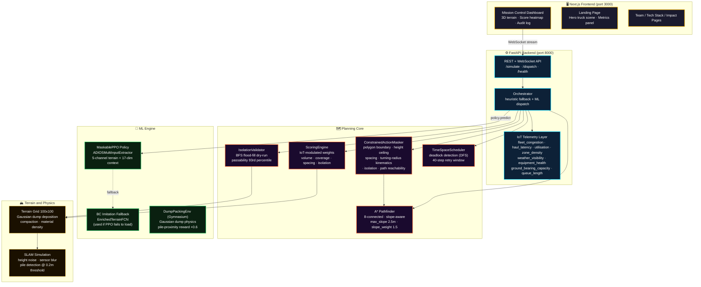
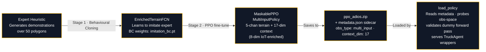
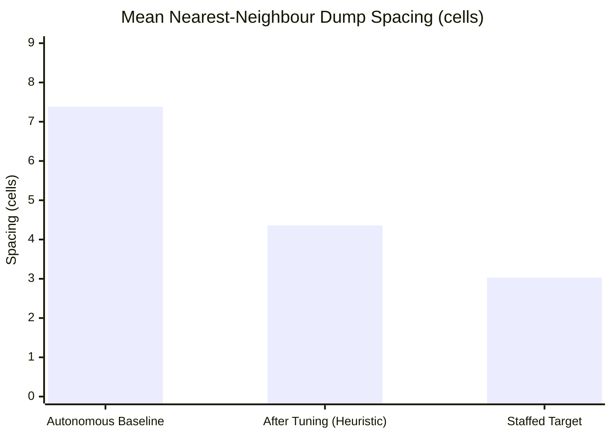
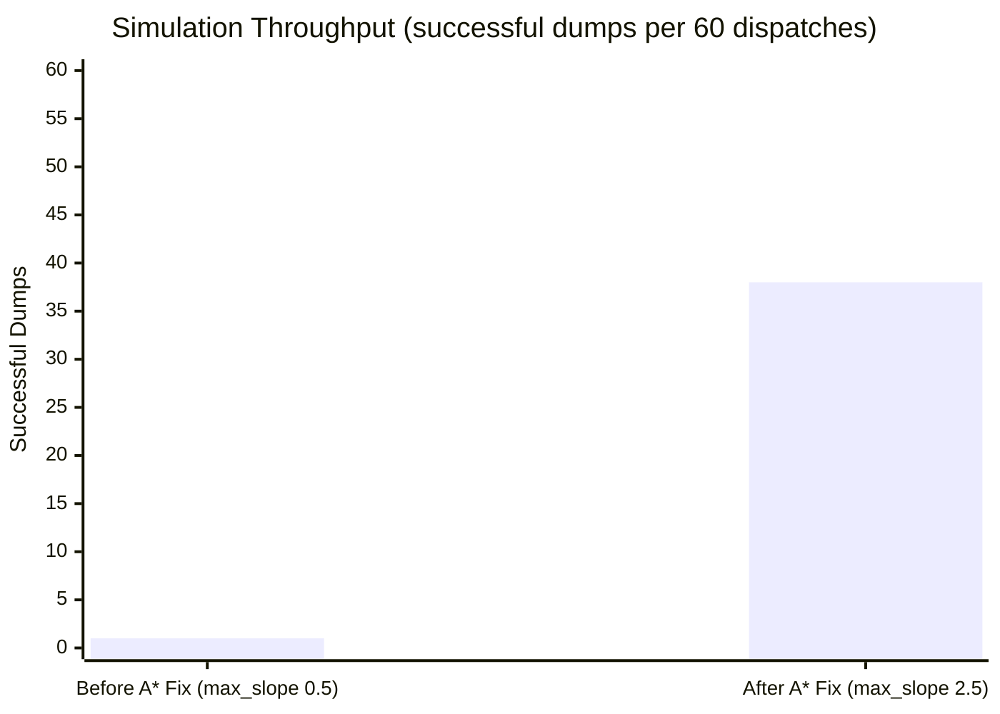
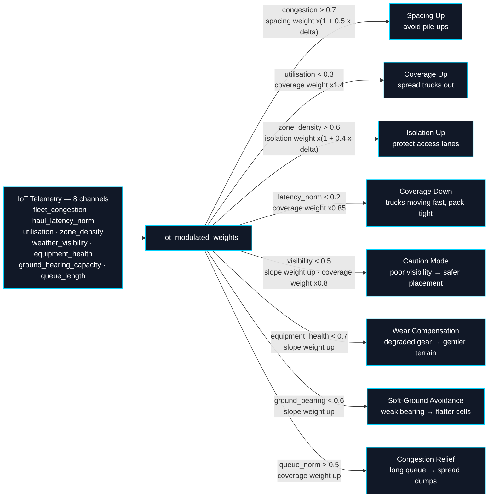

<!--
  README.md — Project overview, architecture, run guide, and ML training instructions for ADIOS.
  This file is the single source of truth for anyone trying to understand, run, or extend the system.
  CATERPILLER Hackathon submission — Problem Statement 4: Optimal Dump Packing
-->

<div align="center">

```
  █████╗ ██████╗ ██╗ ██████╗ ███████╗
 ██╔══██╗██╔══██╗██║██╔═══██╗██╔════╝
 ███████║██║  ██║██║██║   ██║███████╗
 ██╔══██║██║  ██║██║██║   ██║╚════██║
 ██║  ██║██████╔╝██║╚██████╔╝███████║
 ╚═╝  ╚═╝╚═════╝ ╚═╝ ╚═════╝ ╚══════╝
```

# ADIOS — Adaptive Dump Intelligence & Orchestration System


---
[](https://nextjs.org/)
[](https://fastapi.tiangolo.com/)
[](#ml-training)
[](https://docs.pmnd.rs/react-three-fiber)
[](#iot-adaptive-weight-modulation)

</div>

---

## What ADIOS Does

ADIOS answers one question per incoming haul truck: **where should this load be dumped next?**

Instead of relying on a human spotter or a fixed dump zone grid, ADIOS uses a trained reinforcement learning policy (MaskablePPO, IoT-enriched 17-dim context) backed by live terrain state, an 8-channel IoT fleet telemetry layer, constraint-aware action masking, and an A\* path planner to pick the single best cell on the dump site — every dispatch, every truck, in real time.

The result: dump piles are tighter, spacing is more uniform, access lanes stay open, and the site fills closer to a staffed human baseline (target 3.03m mean spacing vs. 7.38m autonomous baseline).

The dashboard's fleet panel is fully configurable without touching code: set **per-class truck counts** (Cat793 / Cat777 / Cat797), override each class's **payload tonnage** to simulate custom fleet mixes, tune the **minimum dump-spacing** safety threshold, and pick from **6 material types** (default, rock, ore, overburden, coal, waste) — each with distinct density, angle of repose, and cross-material compatibility penalties.

---

## System Architecture



---

## Implementation Status — What's Real vs. What's Conceptual

Honest accounting of what's enforced at decision time vs. recorded as metadata
vs. modeled as a simplified stand-in. (Mining-domain context: production
autonomous-haulage systems — Cat MineStar, Komatsu FrontRunner — dump at
**predefined geofenced zones** chosen by a fleet-management system, not via
per-cell optimisation. ADIOS targets the **optimisation layer that could sit
above that planning tier**, not a 1:1 reproduction of today's deployed AHS.)

**Implemented & enforced at runtime (every dispatch, every truck):**
- Isolation prevention — BFS reachability dry-run (`IsolationValidator`), hard-rejects any cell that would fragment the polygon below `iso_threshold`
- A\* path feasibility — every chosen cell is validated end-to-end from entry before commit (`pathfinder.find_path`); infeasible cells yield `path_unreachable` and are re-masked
- **Turning-radius kinematics** — `ConstrainedActionMasker._apply_kinematics` hard-rejects cells a given truck class cannot geometrically maneuver into (boundary-clearance proxy derived from each `TruckProfile.turning_radius_m`); a Cat797 (18m radius) and a Cat777 (11m radius) genuinely see different candidate sets, and rejections are logged per-dispatch as `kinematics_rejected`
- Deadlock/collision avoidance — `TimeSpaceScheduler` reservation grid prevents simultaneous path occupancy
- IoT-adaptive scoring — 8-channel telemetry reshapes heuristic weights live, no retraining required
- Mixed-fleet dispatch — per-truck-class profiles (payload, turning radius, axle load) flow through both the heuristic engine and the ML context vector
- **Angle-of-repose pile shaping** — `dump_physics.relax_slopes` runs sandpile-style talus relaxation after every dump (`_AVALANCHE_PASSES=24`, per-material `angle_of_repose_deg`), so piles settle into plateaued, bench-like mounds bounded by each material's stable slope rather than growing into unbounded Gaussian spikes — plus compaction (`compaction_floor`/`compaction_gain`) when re-dumping onto existing material
- **Material compatibility constraints** — `MATERIAL_COMPATIBILITY` penalises or hard-blocks dumping one material onto an incompatible one already on site (e.g. ore↔waste = blocked, ore↔coal = penalised); 6 materials available (`default`, `rock`, `ore`, `overburden`, `coal`, `waste`), each with distinct density and angle of repose
- **Predictive maintenance** — `AnomalyDetector` runs rolling z-score analysis over the same `equipment_health`/`ground_bearing_capacity` IoT streams already produced (no new sensors), surfacing live anomaly alerts in the dispatch stream
- **Geofenced zone-mode comparison** — `ZonePlanner` partitions the site into per-truck-class rectangular active faces, giving a runnable side-by-side baseline against ADIOS's free-form per-cell optimisation (mirrors how production AHS — Cat MineStar / Komatsu FrontRunner — actually segregates mixed fleets)

**Partially implemented (present, used, but simplified):**
- Turning-radius check is a **boundary-clearance heuristic**, not a full Dubins/Reeds-Shepp kinematic feasibility solve — it answers "is there room to swing in," not "what's the exact approach trajectory"
- Ground-bearing capacity is a **synthetic IoT signal** derived from local pile height + noise, not a soil-mechanics / geotechnical model
- "CTDE" framing describes a **shared-policy multi-agent dispatch** (all `TruckAgent`s use the same trained weights and observe the same global terrain map) — closer to centralized dispatch with per-truck context than canonical decentralized execution

**Conceptual / simulation-only (acknowledged gap vs. real mining practice):**
- Cell-level dump-spot optimisation itself — real AHS dumps at geofenced zones, not via live per-cell scoring; this is ADIOS's R&D contribution, not a reproduction of deployed behaviour
- Continuous Gaussian-kernel terrain physics — real terrain models are reconciled periodically via survey/LIDAR passes, not simulated continuously
- Dozer-leveling and multi-pass load overlap — talus relaxation produces physically-bounded plateaus from the deposition + redistribution model itself, but it does not simulate a separate leveling machine actively reshaping the pile between truck cycles, the way a real active face operates

---

## ML Pipeline — How The Policy Learns



**Why two stages?**
- **Stage 1 (BC)** gives the PPO a warm start — it doesn't have to explore randomly from scratch. The policy already knows roughly where to dump before PPO kicks in.
- **Stage 2 (PPO)** fine-tunes with real rewards: volume filled, spacing tightness, isolation safety, pile-proximity bonus. It learns to outperform the heuristic on unseen polygons.

---

## Observation Space — What The Policy Sees 

Each truck gets a **Dict observation** with two components:

```
{
  "terrain_map":    shape (5, 100, 100)   ← 5-channel enriched terrain grid
  "context_vector": shape (17,)            ← per-truck + material + IoT features
}
```

| Channel | What It Encodes |
|---------|----------------|
| `ch0` — height_norm | Normalised dump height (0–1 over max 18m) |
| `ch1` — polygon mask | 1 = inside dump zone boundary, 0 = outside |
| `ch2` — dist_boundary | Distance to nearest boundary wall (normalised) |
| `ch3` — pile_mask | SLAM pile detection map (threshold 0.2m) |
| `ch4` — spacing_density | Gaussian density of existing dump centres |

`context_vector` = `TRUCK_FEATURE_DIM (9)` + `IOT_FEATURE_DIM (8)` = **17**

| Context Index | Feature |
|--------------|---------|
| 0–3 | Truck type one-hot (Cat793 / Cat777 / Cat797 / generic) |
| 4 | Payload (normalised 0–1, ceiling 500t) |
| 5 | Dump count (normalised by max dumps) |
| 6 | Local density (normalised) |
| 7 | Compaction factor |
| 8 | Slope angle at current position |
| 9 | Fleet congestion (IoT) |
| 10 | Haul latency norm (IoT, 20-tick window) |
| 11 | Fleet utilisation (IoT) |
| 12 | Zone density (IoT) |
| 13 | Weather visibility (IoT, slow drifting random walk) |
| 14 | Equipment health (IoT, per-truck wear/recovery model) |
| 15 | Ground bearing capacity (IoT, derived from local pile height) |
| 16 | Queue length, normalised (IoT, entry congestion depth) |

---

## How The Policy Loads — Graceful Degradation

**Stable Baselines3 only loads `.zip` checkpoints** — `MaskablePPO.load("ppo_adios")` internally appends `.zip` and reads `policy.pth` / `data` / `policy.optimizer.pth` from inside the archive. Our `load_policy()` ([ml/policy.py](backend/ml/policy.py)) wraps this with a multi-tier fallback so the system never hard-fails on a stale or missing checkpoint:

```
MaskablePPO MultiInput (validated against current CONTEXT_DIM)
    ↓ on failure
Legacy CNN policy
    ↓ on failure
Standard PPO
    ↓ on failure
BC imitation (imitation_bc.pt)
    ↓ on failure
Heuristic-only (ScoringEngine)
```

Each tier is validated with a dummy forward pass against the live `CONTEXT_DIM` from `config.py` before being accepted — so changing `IOT_FEATURE_DIM` / `CONTEXT_DIM` (e.g. when adding new telemetry channels) never crashes the API; it just gracefully falls back until you retrain.

The `metadata.json` sidecar next to each checkpoint records its `context_dim`, `obs_type`, and architecture, which is how `load_policy()` validates compatibility without a full model load.

---

## Spacing Gap — Before vs. After 





---

## IoT Adaptive Weight Modulation

At every heuristic dispatch, live telemetry shifts the scoring weights in real time — no retraining needed:



---

## Key Parameter Changes

| Parameter | Before | After | Why |
|-----------|--------|-------|-----|
| `min_dump_spacing_cells` | 3.0 | **2.0** | Close gap to staffed 3.03m target |
| `iso_threshold` | 0.85 | **0.88** | Better balance: safety vs throughput |
| `dump_radius_cells` | 8 | **6** | Tighter pile footprint |
| `dump_sigma_ratio` | 0.45 | **0.35** | Higher peak density per pile |
| `spacing` score weight | 1.5 | **3.0** | Penalise gaps 2x harder |
| `volume` score weight | 1.0 | **1.5** | Prefer cells that fill more material |
| `coverage` score weight | 1.0 | **1.8** | Prefer unfilled polygon sections |
| `passability_percentile` | 97 | **93** | Less restrictive BFS ceiling → more valid paths |
| `scheduler_max_delay_steps` | 25 | **40** | More scheduler retries → fewer deadlocks |
| `pile_detection_threshold_m` | 0.3m | **0.2m** | Earlier SLAM pile sensing |
| `A* max_slope` | 0.5m | **2.5m** | **Critical fix** — 0.5m blocked all paths on real pile heights |
| `iot_haul_latency_window` | 10 ticks | **20 ticks** | Smoother IoT signal |
| `max_height_m` | 15m | **18m** | More vertical fill before rejection |

---

## Project Structure

```
adaptive-dump-intelligence/
├── backend/
│   ├── api/
│   │   └── main.py                    # FastAPI app — REST + WebSocket endpoints
│   ├── config.py                      # All tunable constants (single source of truth)
│   ├── environment/
│   │   ├── terrain.py                 # Terrain grid, Gaussian dump physics, SLAM
│   │   └── dump_physics.py            # Compaction and material density calculations
│   ├── evaluation/
│   │   ├── benchmark.py               # 20-polygon benchmark suite
│   │   ├── compute_eval.py            # PPO vs heuristic KPI comparison
│   │   └── metrics.py                 # Coverage, spacing, efficiency metrics
│   ├── iot/
│   │   └── telemetry.py               # Fleet IoT telemetry (congestion, latency, etc.)
│   ├── ml/
│   │   ├── environment.py             # DumpPackingEnv (Gymnasium, 5-channel obs)
│   │   ├── policy.py                  # load_policy(), ADIOSMultiInputExtractor, TruckAgent
│   │   ├── anomaly_detector.py        # Rolling z-score predictive-maintenance detector
│   │   ├── data_gen.py                # Expert demonstration generator (for BC)
│   │   ├── train_supervised.py        # Stage 1: behavioural cloning trainer
│   │   └── weights/
│   │       ├── ppo_adios.zip          # ← SB3 loads THIS (MaskablePPO MultiInput, context_dim=17)
│   │       └── ppo_adios/
│   │           ├── imitation_bc.pt    # BC fallback weights (Stage 1 warm-start)
│   │           ├── eval_result.json   # PPO vs heuristic efficiency delta
│   │           └── metadata.json      # obs-space sidecar (obs_type, context_dim, architecture)
│   ├── planning/
│   │   ├── orchestrator.py            # Dispatch loop — ML + heuristic paths
│   │   ├── scorer.py                  # ScoringEngine + IoT weight modulation
│   │   ├── isolation_validator.py     # BFS flood-fill isolation check
│   │   ├── action_masker.py           # ConstrainedActionMasker (+ turning-radius kinematics gate)
│   │   ├── zone_planner.py            # Geofenced per-class zone partitioning (zone-mode comparison)
│   │   ├── pathfinder.py              # A* slope-aware grid pathfinder
│   │   ├── scheduler.py               # TimeSpaceScheduler + deadlock detection
│   │   └── weight_tuner.py            # Random-search weight optimiser
│   ├── pretrain.py                    # Main training entry point (BC then PPO)
│   └── requirements.txt
│
└── frontend/
    ├── src/
    │   ├── app/
    │   │   ├── page.tsx               # Landing page (hero truck scene + metrics)
    │   │   ├── dashboard/             # Live simulation dashboard
    │   │   ├── audit/                 # Audit log replay
    │   │   ├── scheduling/            # Gantt chart scheduling view
    │   │   ├── intelligence/          # ML engine explainer
    │   │   ├── impact/                # Business impact page
    │   │   ├── team/                  # Team page (4 members)
    │   │   └── tech-stack/            # Tech stack overview
    │   ├── components/
    │   │   ├── landing/               # LandingHeroScene (React Three Fiber)
    │   │   └── dashboard/             # MetricsPanel, BenchmarkPanel, ControlPanel
    │   ├── lib/api.ts                 # API client (REST + WebSocket)
    │   ├── store/simStore.ts          # Zustand simulation state
    │   └── types/adios.ts             # Shared TypeScript types
    └── package.json
```

---

## How To Run

### Prerequisites

- Python 3.11+
- Node.js 18+
- ~4 GB RAM (for PPO inference)

---

### Step 1 · Backend Setup

```bash
# Enter the backend folder
cd backend

# Create a virtual environment (keeps dependencies isolated)
python3 -m venv .venv

# Activate it
source .venv/bin/activate          # Mac / Linux
# .venv\Scripts\activate           # Windows

# Install all Python dependencies (production/serving footprint)
pip install -r requirements.txt

# Also install sb3-contrib for MaskablePPO (required for PPO inference)
pip install sb3-contrib
```

> Training, linting, and testing need a few extra packages (tensorboard, pytest,
> flake8) that the live server never imports — install those with
> `pip install -r requirements-dev.txt` instead (it layers on top of
> `requirements.txt`). Keeping them separate keeps the deploy footprint lean.

---

### Step 2 · Start The Backend Server

```bash
# Make sure you're in backend/ with .venv active
cd backend
source .venv/bin/activate

# Start FastAPI (auto-reloads on file changes during development)
uvicorn api.main:app --reload --port 8000
```

Expected output:
```
INFO:     Policy loaded: Maskable PPO (IoT-Enriched)
INFO:     Uvicorn running on http://127.0.0.1:8000
```

Verify at `http://localhost:8000/health`:
```json
{
  "status": "ok",
  "policy_type": "maskable_ppo",
  "policy_display_name": "Maskable PPO (IoT-Enriched)"
}
```

> If you see `"policy_display_name": "heuristic"`, the PPO weights didn't load.
> Check that `backend/ml/weights/ppo_adios.zip` exists and that its `metadata.json`
> sidecar's `context_dim` matches `CONTEXT_DIM` in `backend/config.py` (currently **17**).
> If the dimensions mismatch (e.g. after adding new IoT channels), retrain with `python pretrain.py`.

---

### Step 3 · Start The Frontend

```bash
# Open a new terminal tab (keep the backend running in the other one)
cd frontend

# Install Node dependencies
npm install

# Start the dev server
npm run dev
```

Open `http://localhost:3000` — the landing page loads with the 3D truck scene.

For a production build:
```bash
npm run build
npm start
```

---

### Step 4 · ML Training (Optional — weights already included)

You don't need to train to run the demo — a trained checkpoint (`ppo_adios.zip`, `context_dim=17`, IoT-enriched) is already in the repo at `backend/ml/weights/`. But if you want to train a fresh policy (e.g. after changing `IOT_FEATURE_DIM` / `CONTEXT_DIM` or terrain reward shaping):

```bash
cd backend
source .venv/bin/activate

# Default: 100K steps on CPU (~12 minutes, demo quality)
python pretrain.py

# Reduced run for quick iteration (~10 minutes on CPU)
python pretrain.py --steps 25000

# Skip BC stage and go straight to PPO (faster, slightly worse warm start)
python pretrain.py --steps 100000 --skip-bc

# Custom output path
python pretrain.py --steps 100000 --out ml/weights/my_new_run
```

What gets created/overwritten after training:
```
ml/weights/ppo_adios.zip       ← SB3 MaskablePPO checkpoint (this is what load_policy() loads)
ml/weights/ppo_adios/
├── imitation_bc.pt            ← BC fallback weights (Stage 1 output)
├── metadata.json              ← obs-space sidecar (obs_type: multi_input, context_dim: 17)
└── eval_result.json           ← PPO vs heuristic efficiency delta
```

`WEIGHTS_PATH` in `backend/api/main.py` already points at `ml/weights/ppo_adios` — no edits needed unless you use `--out` to write somewhere else.

---

### Step 5 · Run Benchmark Evaluation (Optional)

Compare PPO vs heuristic across 20 held-out polygons and print all 10 KPIs:

```bash
cd backend
source .venv/bin/activate

python -m evaluation.compute_eval
```

---

## Troubleshooting

| Symptom | Fix |
|---------|-----|
| `ModuleNotFoundError: sb3_contrib` | `pip install sb3-contrib` |
| Health shows `"heuristic"` instead of PPO | Ensure `ppo_adios.zip` exists in `backend/ml/weights/` and its `metadata.json` `context_dim` matches `CONTEXT_DIM` in `config.py` |
| `context_dim` mismatch after changing `IOT_FEATURE_DIM` | Retrain with `python pretrain.py` — `load_policy()` falls back gracefully (BC → heuristic) until you do |
| All simulation dispatches fail with `path_unreachable` | Verify `max_slope=2.5` in [planning/pathfinder.py:14](backend/planning/pathfinder.py) |
| Frontend can't connect to backend | Backend must be on port 8000; check CORS (enabled by default in `main.py`) |
| Port 3000 already in use | `npm run dev -- --port 3001` |
| Port 8000 already in use | `uvicorn api.main:app --port 8001` then update `frontend/src/lib/config.ts` |

---

## Tech Stack

| Layer | Technology |
|-------|-----------|
| Frontend framework | Next.js 15 (App Router) |
| 3D rendering | React Three Fiber + Three.js |
| Animations | Framer Motion + GSAP |
| State management | Zustand |
| Backend framework | FastAPI + Uvicorn |
| WebSocket streaming | FastAPI WebSocket |
| RL framework | Stable Baselines 3 + sb3_contrib |
| Policy type | MaskablePPO (MultiInputPolicy) |
| Neural net | PyTorch 2.11 |
| Environment | Gymnasium (custom DumpPackingEnv) |
| Terrain physics | NumPy · SciPy Gaussian |
| Path planning | Custom A\* (8-connected, slope-aware) |
| IoT telemetry | Custom rolling-window telemetry layer |

---

<div align="center">

## Built by Team Butterfly

**Anushka Nair · Arjit Tripathi · Shivani Srivastava · Yashee Hinger**

*Safer placement. Higher capacity. Smarter terrain.*

</div>
